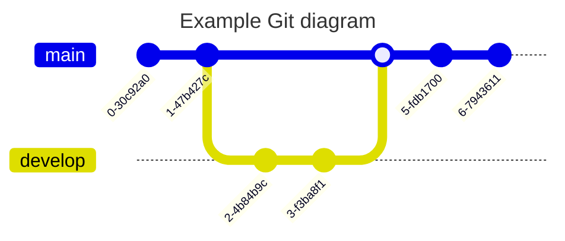
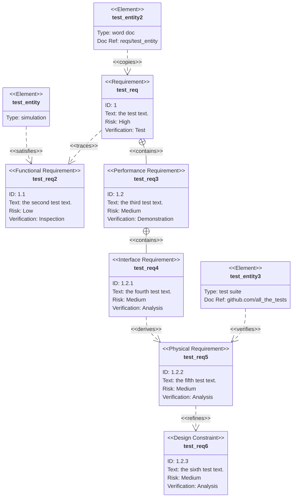

# DSP


# References

[Engineering Classes abbreviated as EnggClasses is to provide the quality education at free of cost, through short length videos, for Engineering Students](https://www.youtube.com/@EnggClasses)

  The main objective of Engineering Classes abbreviated as EnggClasses is to provide the quality education at free of cost, through short length videos, for Engineering Students.
  The different courses covered are:
  Signals and Systems
  Digital Signal Processing
  Microcontroller 8051
  Digital Electronics
  Number Systems
  and many more to come in near future..

- [ ] [:tv: Delta-Sigma Modulator Basics](https://www.youtube.com/watch?v=NrkFd7h6R2Y)
- [ ] [:tv: A lecture on the z Transform](https://www.youtube.com/watch?v=dq7-Bqu8HRA)
- [ ] [Signals: Complex Exponentials](https://www.youtube.com/watch?v=UxR2CMgvtLk&t=53s)

```math
e^{j\omega_0t} \to j = \sqrt{- 1}
``` 

> Difference between a mathematician and an engineer, i represents current then j is used instead

- [ ] [You're viewing icons for v5.15.4](https://fontawesome.com/v5/search?o=r&m=free)
- [ ] [Mermaid JS](https://mermaid.js.org/intro/)
- [ ] [Mermaid Live](https://mermaid.live/)




