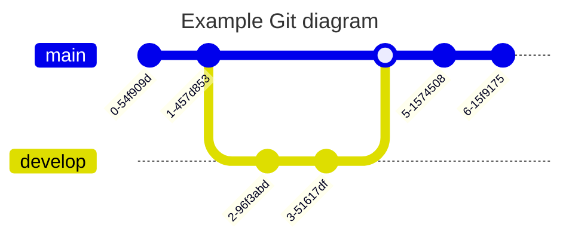
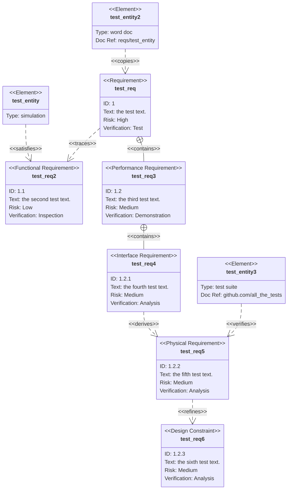

# DSP


A **step-by-step roadmap to go from no analog experience → mixed-signal / RF engineer at UofT**, with a path toward DFEs, GTYs, and even tapeout-level experience:

 

---

## **Mixed-Signal / RF Learning Roadmap**

### **1. Foundation (Undergraduate / Self-Study)**

**Goal:** Build strong analog + digital basics before tackling RF/mixed-signal.

| Focus                             | Actions / Courses                     | Notes                                                     |
| --------------------------------- | ------------------------------------- | --------------------------------------------------------- |
| **Basic Electronics**             | Circuits 1 & 2 (ECE undergrad)        | Ohm’s law, capacitors, op-amps, BJT/MOSFET basics         |
| **Digital Logic**                 | Digital Systems Design                | Logic gates, flip-flops, combinational & sequential logic |
| **Signals & Systems**             | Signals & Systems, Fourier Transforms | Frequency domain, filtering, modulation basics            |
| **Programming / MATLAB / Python** | Simulate circuits, DSP algorithms     | Useful for DFE simulations, filters, and RF signals       |

---

### **2. Intermediate – Analog & Mixed-Signal**

**Goal:** Learn analog ICs, mixed-signal blocks, and FPGA integration.

| Focus                      | Actions / Courses                                                              | Notes                                                               |
| -------------------------- | ------------------------------------------------------------------------------ | ------------------------------------------------------------------- |
| **Analog IC Design**       | ECE graduate-level course: *Analog and Mixed-Signal Integrated Circuit Design* | Covers op-amps, comparators, ADC/DAC design                         |
| **VLSI Circuits**          | *VLSI Design* course                                                           | Combines digital & analog IC design                                 |
| **Mixed-Signal FPGA Labs** | Use ZCU67, ZU15EG, or Nexys/F4PGA boards                                       | Prototype FIR filters, DDC/DUC, simple DAC/ADC interfacing          |
| **DSP & DFEs**             | *Digital Signal Processing* course                                             | Implements filters, NCO, decimation/interpolation in FPGA or MATLAB |

---

### **3. Advanced – RF, Transceivers & High-Speed Digital**

**Goal:** Learn DFEs, GTYs, and real-world RF hardware integration.

| Focus                         | Actions / Labs                     | Notes                                                                  |
| ----------------------------- | ---------------------------------- | ---------------------------------------------------------------------- |
| **RFIC / RF CMOS**            | Join a professor’s RFIC lab        | Work on high-speed ADC/DAC, PLL, GTY transceivers, RF front-end        |
| **High-Speed SerDes & GTYs**  | FPGA + Vivado labs                 | Configure GTYs, multi-gigabit links, 25G/50G Ethernet, JESD204B/C      |
| **DFE / Baseband Processing** | Implement FIR/CIC/NCO on FPGA      | Learn digital front-end pipelines, crest factor reduction, beamforming |
| **PCB/Analog Integration**    | Analog front-end boards with RFSoC | Experience in analog layout, matching, signal integrity                |

---

### **4. Expert – Tapeout / Custom Chip Design**

**Goal:** Move from prototyping to designing your own hardened blocks.

| Focus                      | Actions                               | Notes                                                                  |
| -------------------------- | ------------------------------------- | ---------------------------------------------------------------------- |
| **Open-Source PDKs**       | Sky130 / OpenROAD / OpenFPGA          | Prototype small mixed-signal blocks in CMOS                            |
| **Custom DFE / ADC/DAC**   | Tapeout lab project / research        | Implement your own DFEs or pre-distortion blocks                       |
| **RF System Verification** | RFSoC + lab measurement               | Learn to measure SNR, linearity, and crest factor for high-speed links |
| **Publication / Thesis**   | Research papers on RFSoC / custom ICs | Strong portfolio for industry or further PhD work                      |

---

### **5. Optional Self-Study / Supplements**

* **Books**:

  * *RF Microelectronics* by Behzad Razavi
  * *CMOS Analog Circuit Design* by Allen & Holberg
* **FPGA + Mixed-Signal Labs**: Hands-on projects with ZCU67/ZU15EG boards
* **Software tools**: MATLAB, Vivado, Cadence Virtuoso, OpenROAD, Sky130 PDK

---

✅ **Key Advantage**: By the end, you can:

* Understand **analog/mixed-signal circuits at the transistor level**
* Integrate **digital DFEs with analog ADC/DAC**
* Work on **high-speed GTYs, SerDes, and RFSoC prototyping**
* Potentially do **tapeout-level custom mixed-signal blocks**


# References

[Engineering Classes abbreviated as EnggClasses is to provide the quality education at free of cost, through short length videos, for Engineering Students](https://www.youtube.com/@EnggClasses)

  The main objective of Engineering Classes abbreviated as EnggClasses is to provide the quality education at free of cost, through short length videos, for Engineering Students.
  The different courses covered are:
  Signals and Systems
  Digital Signal Processing
  Microcontroller 8051
  Digital Electronics
  Number Systems
  and many more to come in near future..

- [ ] [:tv: Delta-Sigma Modulator Basics](https://www.youtube.com/watch?v=NrkFd7h6R2Y)
- [ ] [:tv: A lecture on the z Transform](https://www.youtube.com/watch?v=dq7-Bqu8HRA)
- [ ] [Signals: Complex Exponentials](https://www.youtube.com/watch?v=UxR2CMgvtLk&t=53s)

```math
e^{j\omega_0t} \to j = \sqrt{- 1}
``` 

> Difference between a mathematician and an engineer, i represents current then j is used instead

- [ ] [You're viewing icons for v5.15.4](https://fontawesome.com/v5/search?o=r&m=free)
- [ ] [Mermaid JS](https://mermaid.js.org/intro/)
- [ ] [Mermaid Live](https://mermaid.live/)


```mermaid
---
title: Example Git diagram
---
gitGraph
   commit
   commit
   branch develop
   checkout develop
   commit
   commit
   checkout main
   merge develop
   commit
   commit
```


```mermaid
requirementDiagram

    requirement test_req {
    id: 1
    text: the test text.
    risk: high
    verifymethod: test
    }

    functionalRequirement test_req2 {
    id: 1.1
    text: the second test text.
    risk: low
    verifymethod: inspection
    }

    performanceRequirement test_req3 {
    id: 1.2
    text: the third test text.
    risk: medium
    verifymethod: demonstration
    }

    interfaceRequirement test_req4 {
    id: 1.2.1
    text: the fourth test text.
    risk: medium
    verifymethod: analysis
    }

    physicalRequirement test_req5 {
    id: 1.2.2
    text: the fifth test text.
    risk: medium
    verifymethod: analysis
    }

    designConstraint test_req6 {
    id: 1.2.3
    text: the sixth test text.
    risk: medium
    verifymethod: analysis
    }

    element test_entity {
    type: simulation
    }

    element test_entity2 {
    type: word doc
    docRef: reqs/test_entity
    }

    element test_entity3 {
    type: "test suite"
    docRef: github.com/all_the_tests
    }


    test_entity - satisfies -> test_req2
    test_req - traces -> test_req2
    test_req - contains -> test_req3
    test_req3 - contains -> test_req4
    test_req4 - derives -> test_req5
    test_req5 - refines -> test_req6
    test_entity3 - verifies -> test_req5
    test_req <- copies - test_entity2
```
