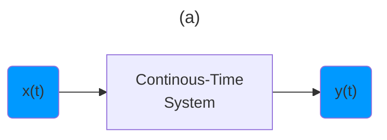
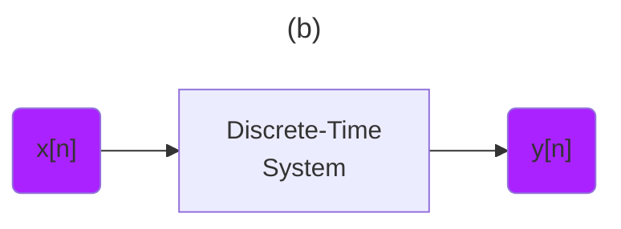
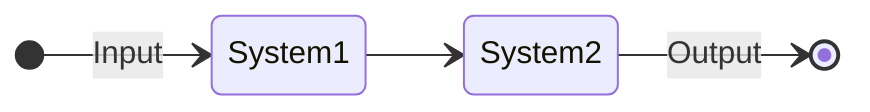
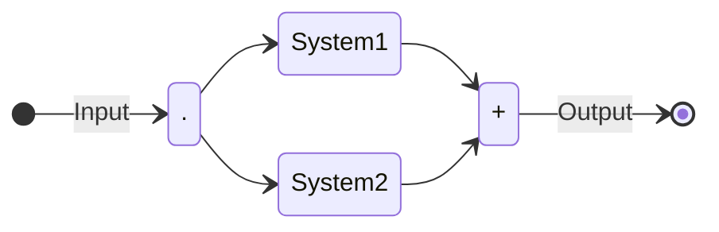
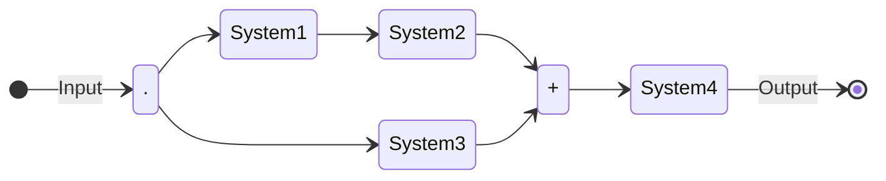

[Introduction to Signal Processing: Properties of Signals (Lecture 5)](https://youtu.be/Gw8eE93OyUY)

---

$${\color{Yellow} \text{ Transforming Signals} }$$





---

```math
{\color{Purple} \text{ System Level Processsing } }
```

```math
{\color{Yellow} \text{ Transforming Signals } }
```

```math
x(t) \to y(t)
```

```math
x[n] \to y[n]
```

---

```math
{\color{Cerulean} \text{ System Level Processsing } }
```



```math
{\color{Purple} \text{ Processing in series } }
```



```math
{\color{Green} \text{ + (Addition of Signals) } }
```


```math
{\color{Purple} \text{ Processing in parallel } }
```



```math
{\color{Purple} \text{ Series and parallel } }
```

---

- [ ] System Properties

```math
{\color{Yellow} \text{ Memory } }
```

```math
y[n] = (2x[n] + x^2[n])
```

```math
\begin{gather}
    {\color{Purple} \text{ Memoryless system } } \\
    {\color{Green} \text{ Future only depends on current time } }
\end{gather}
```


```math
y[n] = x[n - 1]
```

```math
{\color{Purple} \text{ Memory system } }
{\color{Green} \text{ Accumulator/Summer } }
```


```math
y[n] = \sum_{k=-\infty}^{n} x[k]
```

```math
y(t) = \int_{-\infty}^{t} x(\tau)d\tau
```

```math
{\color{Yellow} \text{ Invertible } }
```

```math
{\color{Purple} \dots \text{ Distinct Inputs - Distinct Outputs } \dots }
```

```math
{\color{Purple} \text{ Transform } }
```

```math
y(t) = 2x(t)
```

```math
{\color{Purple} \text{ Invert } }
```

```math
w(t) = \frac{1}{2} y(t)
```

 </img>

```math
{\color{Yellow} \text{ Non Invertible } }
```

```math
y(t) = 0
```

```math
y(t) = x^2(t)
```

$${
\color{Green} \mathbf{ 
CAUSALITY \space IS \space SO \space TIRING \space
BUT \space WE \space WILL \space SEE
} 
}$$

```math
{\color{Yellow} \text{ Memoryless systems are causal } }
```


## [:back: ](../#round_pushpin-signal-processing-an-introduction)

