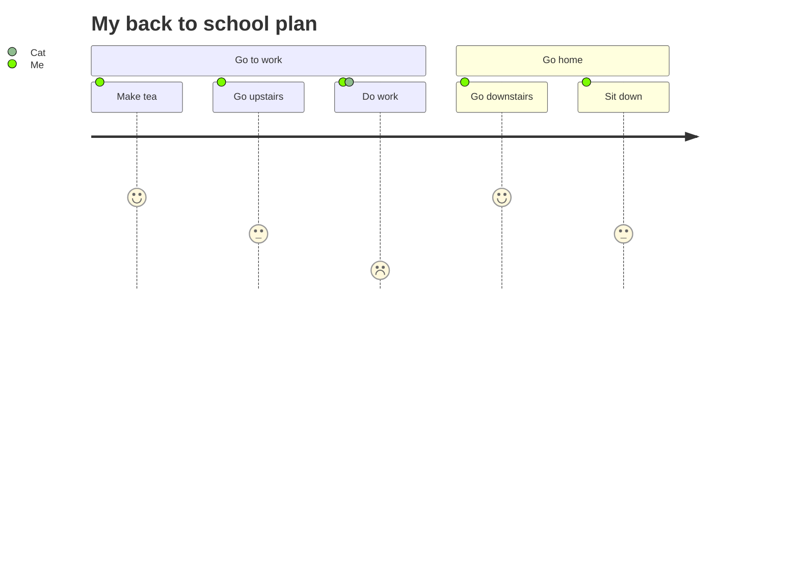
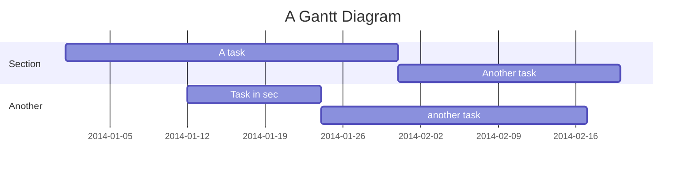
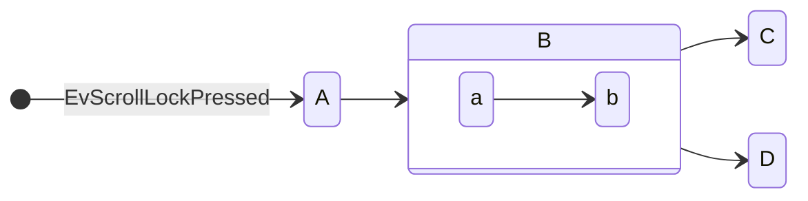

# Plan

```mermaid
journey
    title My back to school plan
    section Go to work
      Make tea: 5: Me
      Go upstairs: 3: Me
      Do work: 1: Me, Cat
    section Go home
      Go downstairs: 5: Me
      Sit down: 3: Me
  
```

```mermaid
gantt
    title A Gantt Diagram
    dateFormat  YYYY-MM-DD
    section Section
    A task           :a1, 2014-01-01, 30d
    Another task     :after a1  , 20d
    section Another
    Task in sec      :2014-01-12  , 12d
    another task      : 24d
```

```mermaid
stateDiagram
    direction LR
    [*] --> A : EvScrollLockPressed
    A --> B
    B --> C
    state B {
      direction LR
      a --> b
    }
    B --> D
```
