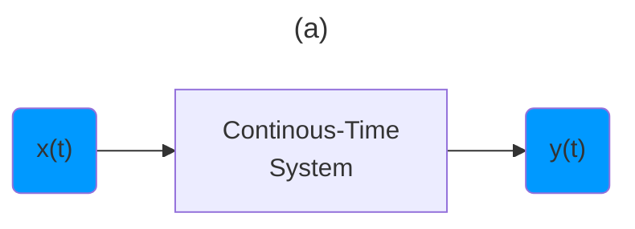
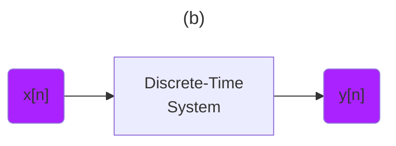

:one: [Introduction to Signal Processing: An Overview (Lecture 1)](https://www.youtube.com/watch?v=kjw6W0SZe04&t=0s) 

[Signal Processsing](https://en.wikipedia.org/wiki/Signal_processing) is an electrical engineering subfield that focuses on analyzing, modifying and synthesizing (i.e [System analisys](https://en.wikipedia.org/wiki/System_analysis) ) signals, such as sound, images, potential fields, seismic signals, altimetry processing, and scientific measurements.[1] Signal processing techniques are used to optimize transmissions, digital storage efficiency, correcting distorted signals, subjective video quality and to also detect or pinpoint components of interest in a measured signal.[2]

- [ ] Diversity of signals


[Electromagnetic Spectrum](https://www.britannica.com/science/electromagnetic-spectrum)

 </img>

 </img>

[Frequency and Wavelength of 5G and electromagnetic spectrum](https://nasafes.com/facts-about-5g-and-the-electromagnetic-spectrum)

 </img>

 </img>

[Rivals get Rogered in Canadian 600 MHz spectrum auction](https://telecoms.com/496888/rivals-get-rogered-in-canadian-600-mhz-spectrum-auction)

 </img>

- [ ] Mathematical Representation
> Continuous - Time
```math
x(t)
```
> Discrete - Index
```math
x[n]
```

- [ ] Transforming Signals





- [ ] Signal Energy

```math
E = \int_{t1}^{t2} | x(t) |^2 \mathrm{d}t
```

```math
E = \sum_{n=n1}^{n2} | x[t] |^2
```

- [ ] Total Signal Energy

```math
E_\infty = \int_{-\infty}^{\infty} | x(t) |^2 \mathrm{d}t
```

```math
E_\infty = \sum_{n=-\infty}^{\infty} | x[t] |^2
```


- [ ] Time-Averaged Signal Power

```math
P_\infty = \lim\limits_{T \to \infty} \frac{1}{2T} \int_{-T}^{T} | x(t) |^2 \mathrm{d}t
```

```math
P_\infty = \lim\limits_{N \to \infty} \frac{1}{2N + 1} \sum_{n=-N}^{N} | x[t] |^2
```

- [ ] Three Important Classes of Signals

I. Finite Energy, Zero Average Power 
```math
E_\infty < \infty, P_\infty = \lim\limits_{T \to \infty} \frac{E_\infty}{2T} = 0
```
II. Finite Average Power, Zero Energy
```math
P_\infty > 0, E_\infty = \infty
```
III. Other

- [ ] All Signals Deliver their Information with Energy and Power

## [:back: ](../#round_pushpin-signal-processing-an-introduction)
