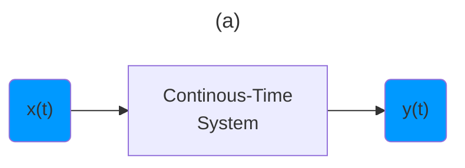

:two: [Introduction to Signal Processing: Basic Signals (Lecture 2)](https://youtu.be/ILek2_KoUmw&t=0)

- [ ] Transformations

> Basic Signal Properties

- [ ] Transforming Signals

```mermaid
---
title: (a)
---
%%{init: {"flowchart": {"htmlLabels": false}} }%%
flowchart LR
    a("x(t)"):::someclass -->b[Continous-Time \n   System]
    b-->d("y(t)"):::someclass
    classDef someclass fill:#09f
```
