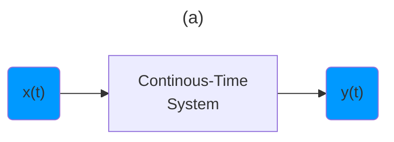
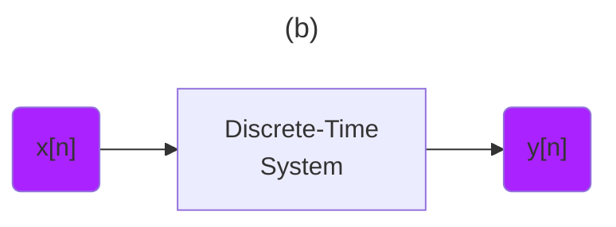

:two: [Introduction to Signal Processing: Basic Signals (Lecture 2)](https://youtu.be/ILek2_KoUmw&t=0)

- [ ] Transformations

> Basic Signal Properties and operations

- [ ] Transforming Signals





- [ ] Time Shifts

> Continuous - Time
```math
x(t) \to x(t - t_0)
```
> Discrete - Index
```math
x[n] \to x[n - n_0]
```

| Continuous Time Shift | Discrete Time Shift  |
|-------------------------------|------------------------------------------------|
|  </img> |  </img>  |

> Scaling
```math
x(t) \to x(\alpha t + \beta)
```

```math
| \alpha | < 1 \text { Stretching}
```

```math
| \alpha | > 1 \text { Compressing}
```

|  |  |
|-------------------------------|------------------------------------------------|
|  </img> |  </img>  |

- [ ] Reflection

> Continuous - Time
```math
x(t) \to x(-t)
```
> Discrete - Index
```math
x[n] \to x[-n]
```

| Continuous Reflection | Discrete Reflection  |
|-------------------------------|------------------------------------------------|
|  </img> |  </img>  |

 </img>

- [ ] Periodic Signals

> Continuous - Time
```math
x(t) \to x(t + P)
```
> Discrete - Index
```math
x[n] \to x[n + N]
```

| Continuous Periodic Signal | Discrete Periodic Signal  |
|-------------------------------|------------------------------------------------|
|  </img> |  </img>  |

- [ ] Even and Odd Signals and decomposition

* Signals

> Even cos(t)

```math
x(t) = x( -t )
```

```math
x[n] = x[ -n]
```
> Odd sin(t)

```math
x(t) = - x( -t )
```

```math
x[n] = - x[ -n]
```

* Decomposition

> Even cos(t)

```math
\varepsilon v \{ x(t) \} = \frac{1}{2} [ x( t ) + x( -t ) ] 
```

```math
\varepsilon v \{ x[n] \} =
  \begin{cases}
    \frac{1}{2}, n < 0 \\
    1, n = 0 \\
    \frac{1}{2}, n > 0
  \end{cases}
```

> Odd sin(t)

```math
\vartheta d \{ x(t) \} = \frac{1}{2} [ x( t ) - x( -t ) ] 
```

```math
\vartheta d \{ x[n] \} =
  \begin{cases}
    - \frac{1}{2}, n < 0 \\
    0, n = 0 \\
    \frac{1}{2}, n > 0
  \end{cases}
```

| Continuous Decomposition | Discrete Decomposition  |
|-------------------------------|------------------------------------------------|
|  </img> |  </img>  |


## [:back: ](../#round_pushpin-signal-processing-an-introduction)


