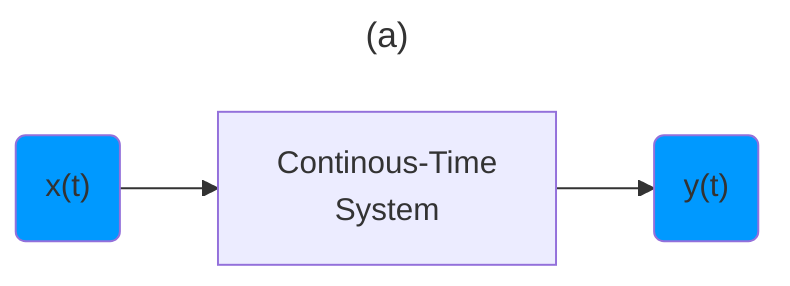
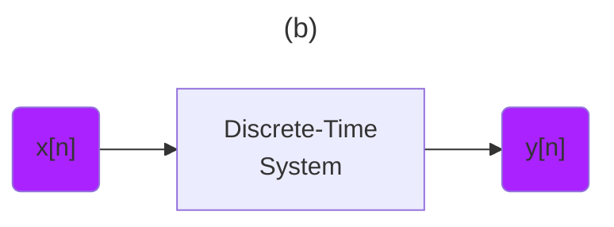

:two: [Introduction to Signal Processing: Basic Signals (Lecture 2)](https://youtu.be/ILek2_KoUmw&t=0)

- [ ] Transformations

> Basic Signal Properties

- [ ] Transforming Signals





- [ ] Time Shifts

> Continuous - Time
```math
x(t) \to x(t - t0)
```
> Discrete - Index
```math
x[n] \to x[n - n0]
```

