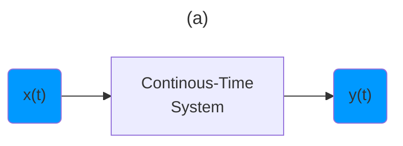
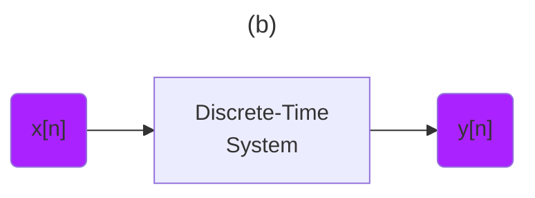

:two: [Introduction to Signal Processing: Basic Signals (Lecture 2)](https://youtu.be/ILek2_KoUmw&t=0)

- [ ] Transformations

> Basic Signal Properties and operations

- [ ] Transforming Signals





- [ ] Time Shifts

> Continuous - Time
```math
x(t) \to x(t - t_0)
```
> Discrete - Index
```math
x[n] \to x[n - n_0]
```

| Continuous Time Shift | Discrete Time Shift  |
|-------------------------------|------------------------------------------------|
|  </img> |  </img>  |

> Scaling
```math
x(t) \to x(\alpha t + \beta)
```

```math
| \alpha | < 1 \text { Stretching}
```

```math
| \alpha | > 1 \text { Compressing}
```

|  |  |
|-------------------------------|------------------------------------------------|
|  </img> |  </img>  |

- [ ] Reflection

> Continuous - Time
```math
x(t) \to x(-t)
```
> Discrete - Index
```math
x[n] \to x[-n]
```

| Continuous Reflection | Discrete Reflection  |
|-------------------------------|------------------------------------------------|
|  </img> |  </img>  |

 </img>
