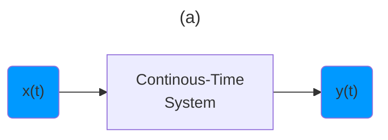
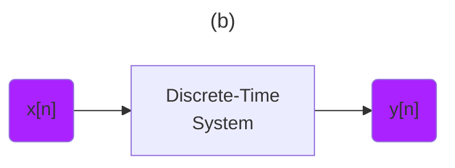
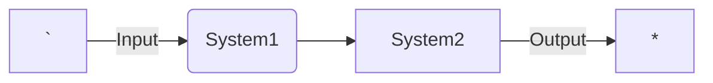
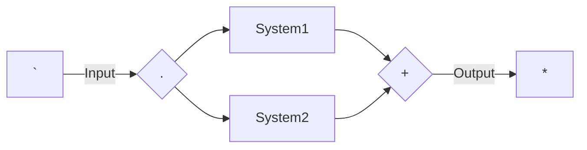
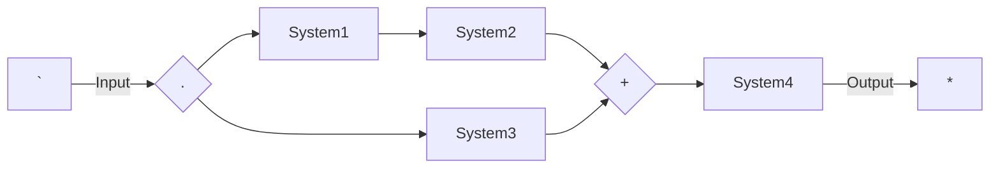

[Introduction to Signal Processing: Properties of Signals (Lecture 5)](https://youtu.be/Gw8eE93OyUY)

---

```math
{\color{Yellow} \text{ Transforming Signals } }
```






---

```math
{\color{Purple} \text{ System Level Processsing } }
```

```math
{\color{Yellow} \text{ Transforming Signals } }
```

```math
x(t) \to y(t)
```

```math
x[n] \to y[n]
```

---

```math
{\color{Cerulean} \text{ System Level Processsing } }
```



```math
{\color{Yellow} \text{ Processing in series } }
```



```math
{\color{Yellow} \text{ Processing in parallel } }
```



```math
{\color{Yellow} \text{ Series and parallel } }
```

---

- [ ] System Properties

```math
{\color{Yellow} \text{ Memory } }
```

```math
{\color{Purple} \text{ Memory system } }
```

```math
y[n] = x[n - 1]
```

```math
{\color{Green} \text{ Accumulator/Summer } }
```


```math
y[n] = \sum_{k=-\infty}^{n} x[k]
```

```math
y(t) = \int_{-\infty}^{t} x(\tau)d\tau
```

```math
{\color{Yellow} \text{ Invertible } }
```

```math
{\color{Purple} \text{ Distinct Inputs - Distinct Outputs } }
```

```math
{\color{Purple} \text{ Transform } }
```

```math
y(t) = 2x(t)
```

```math
{\color{Purple} \text{ Invert } }
```

```math
w(t) = \frac{1}{2} y(t)
```

 </img>

## [:back: ](../#round_pushpin-signal-processing-an-introduction)

