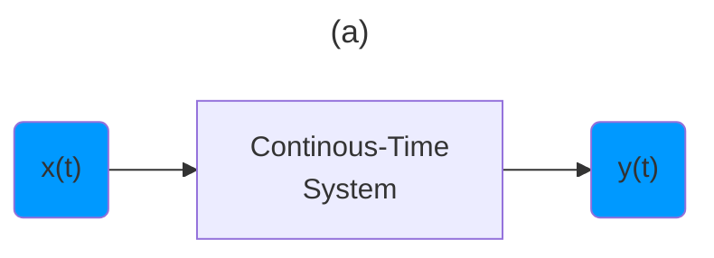
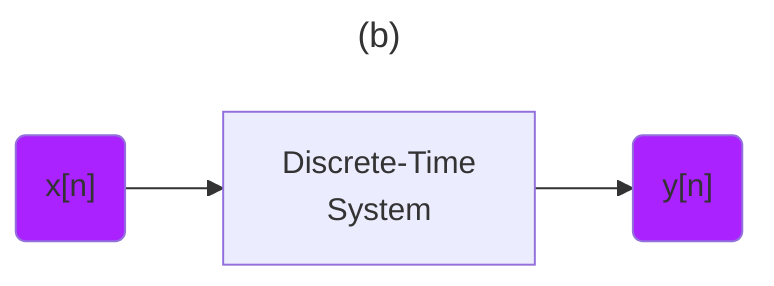
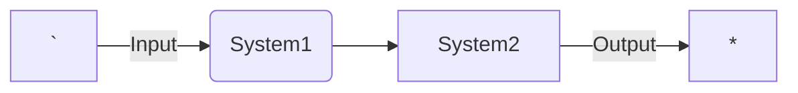
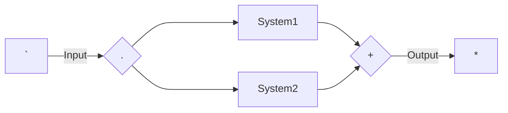

[Introduction to Signal Processing: Properties of Signals (Lecture 5)](https://youtu.be/Gw8eE93OyUY)

---

```math
{\color{Yellow} \text{ Transforming Signals } }
```






---

```math
{\color{Purple} \text{ System Level Processsing } }
```

```math
{\color{Yellow} \text{ Transforming Signals } }
```

```math
x(t) \to y(t)
```

```math
x[n] \to y[n]
```

---

```math
{\color{Cerulean} \text{ System Level Processsing } }
```



```math
{\color{Yellow} \text{ Processing in series } }
```



```math
{\color{Yellow} \text{ Processing in parallel } }
```

## [:back: ](../#round_pushpin-signal-processing-an-introduction)

