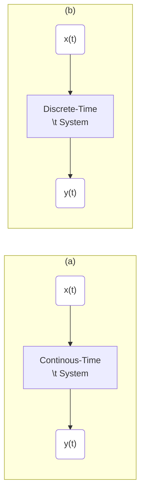
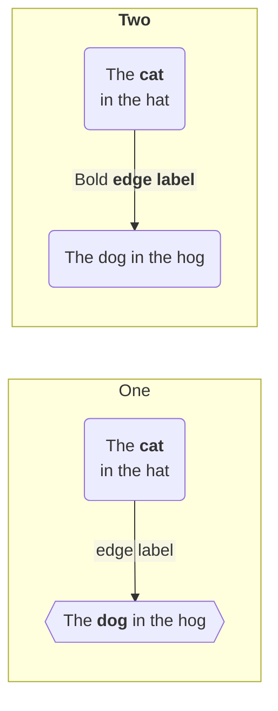

- [ ] [Open-Source Lectures](http://faculty.washington.edu/kutz/page5/page23)
- [ ] [Pr. Nathan Kutz](http://faculty.washington.edu/kutz/page4)

`Short Biography`

Professor Kutz was awarded the B.S. in Physics and Mathematics from the University of Washington in 1990 and the PhD in Applied Mathematics from Northwestern University in 1994. Following postdoctoral fellowships at the Institute for Mathematics and its Applications (University of Minnesota, 1994-1995) and Princeton University (1995-1997), he joined the faculty of applied mathematics and served as Chair from 2007-2015.

`Research Interests`

Numerical methods and scientific computing, data analysis and dimensionality reduction (PCA, POD, etc) methods, dynamical systems, bifurcation theory, linear and nonlinear wave propagation, perturbation and asymptotic methods, nonlinear analysis, variational methods, soliton theory, nonlinear optics, mode-locked lasers, fluid dynamics, Bose-Einstein condensation, neuroscience, gesture recognition and video & image processing


:round_pushpin: [Signal Processing: An Introduction](https://www.youtube.com/playlist?list=PL6Vi_EcJpt8E96_JTKoOKY3HYWVGjf6b4) (Youtube Playlist)

The lectures are from the textbook Oppenheim, Willsky and Nawab, "Systems and Signals".


:one: [Introduction to Signal Processing: An Overview (Lecture 1)](https://www.youtube.com/watch?v=kjw6W0SZe04&t=0s) 


[Electromagnetic Spectrum](https://www.britannica.com/science/electromagnetic-spectrum)

 </img>

 </img>

[Frequency and Wavelength of 5G and electromagnetic spectrum](https://nasafes.com/facts-about-5g-and-the-electromagnetic-spectrum)

 </img>

 </img>

[Rivals get Rogered in Canadian 600 MHz spectrum auction](https://telecoms.com/496888/rivals-get-rogered-in-canadian-600-mhz-spectrum-auction)

 </img>

- [ ] Mathematical Representation
> Continuous - Time
```math
x(t)
```
> Discrete - Index
```math
x[n]
```






```math
\left( \sum_{k=1}^n a_k b_k \right)^2 \leq \left( \sum_{k=1}^n a_k^2 \right) \left( \sum_{k=1}^n b_k^2 \right)
```

:two: [Introduction to Signal Processing: Basic Signals (Lecture 2)](https://youtu.be/ILek2_KoUmw&t=0)

