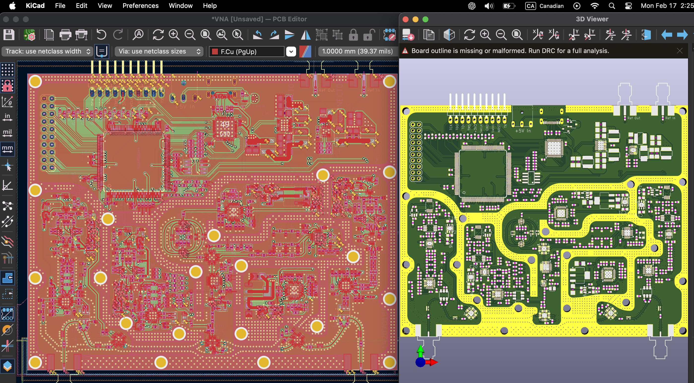
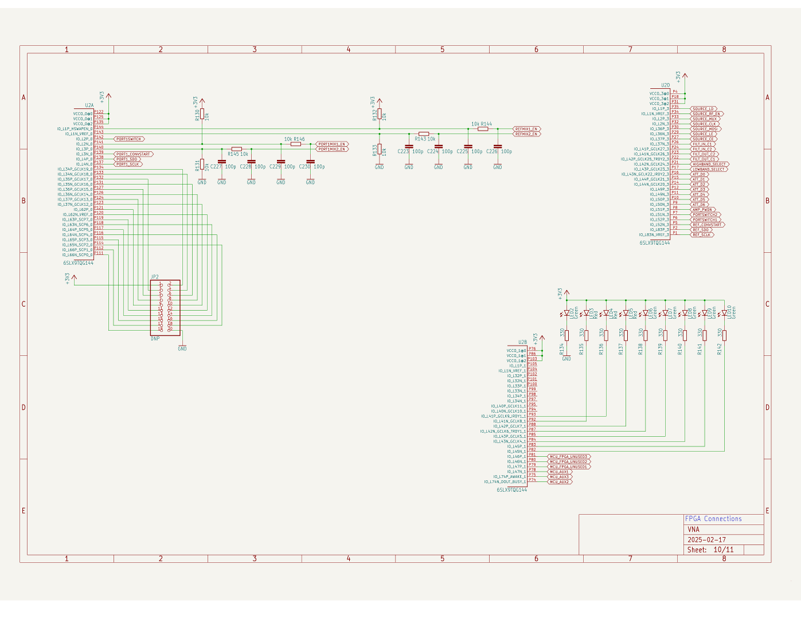

## LibreVNA 

- [ ] [LibreVNA-support](https://groups.io/g/LibreVNA-support)
- [ ] [LibreVNA open-source USB vector network analyzer (VNA) works in the 100kHz to 6GHz range](https://www.cnx-software.com/2024/02/23/librevna-open-source-usb-vector-network-analyzer-vna-works-in-the-100khz-to-6ghz-range/)


```
git clone https://github.com/jankae/LibreVNA
```

- [ ] Open KiCad
- [ ] Import Eagle Project




